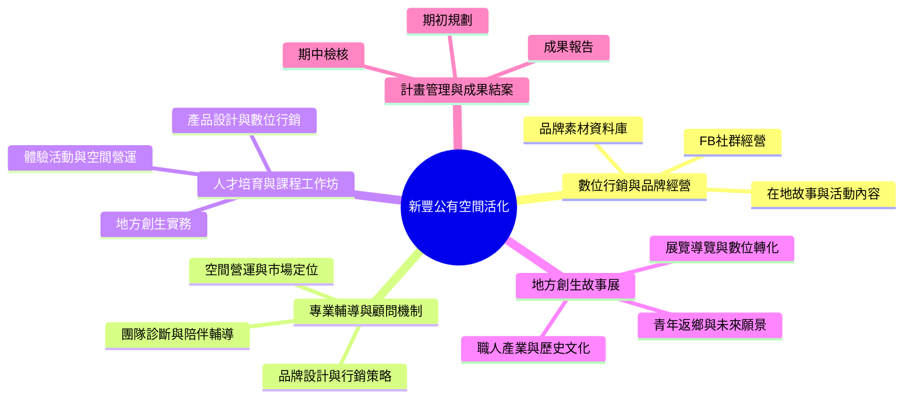

# 115年新豐鄉公所公有空間活化工作項目心智圖

資料來源：`/Users/junghanchiu/Downloads/115年新豐鄉公所公有空間活化工作計劃書.docx`

## 三層簡化版

## 圖像版文字基準

中心：新豐公有空間活化

| 第二層 | 第三層重點 |
|---|---|
| 數位行銷與品牌經營 | FB社群經營；在地故事與活動內容；品牌素材資料庫 |
| 專業輔導與顧問機制 | 品牌設計與行銷策略；空間營運與市場定位；團隊診斷與陪伴輔導 |
| 人才培育與課程工作坊 | 地方創生實務；產品設計與數位行銷；體驗活動與空間營運 |
| 地方創生故事展 | 職人產業與歷史文化；青年返鄉與未來願景；展覽導覽與數位轉化 |
| 計畫管理與成果結案 | 期初規劃；期中檢核；成果報告 |

## 工作期程

| 工作項目 | 6月 | 7月 | 8月 | 9月 | 10月 | 11月 | 12月 |
|---|---|---|---|---|---|---|---|
| 數位行銷與品牌經營 | ● | ● | ● | ● | ● | ● | ● |
| 專業輔導與顧問機制導入 |  | ● | ● | ● | ● | ● |  |
| 人才培育與課程工作坊 |  |  | ● | ● | ● | ● |  |
| 新豐鄉地方創生故事展 |  |  |  |  | ● | ● | ● |
| 計畫執行管理與成果結案 | ● | ● | ● | ● | ● | ● | ● |

## 已確認規格

| 項目 | 確認後版本 |
|---|---|
| 專業輔導與顧問機制 | 辦理諮詢輔導至少 3 場次 |
| 人才培育與課程工作坊 | 辦理 1 場以上，至少 20 人 |
| 社群貼文數 | 6-12 月每月 1 則，合計至少 7 篇 |
| 社群平台瀏覽 | 社群平台瀏覽次數達 200 人次以上 |
